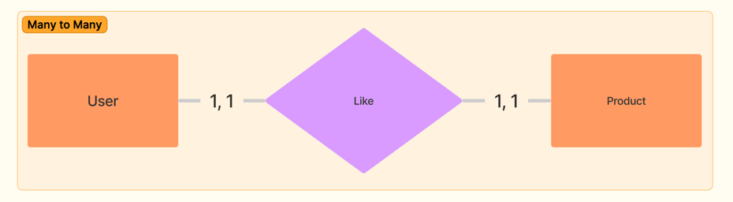
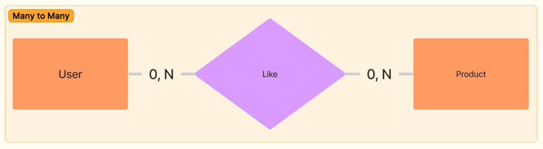

# Correction MCD

## Lien Address & Order.

Je pense ici qu'il te manque une relation entre `address` et le `order`, de mon point de vu, sur l'order devrait contenir l'adresse de livraison.
 > Tu ne peux pas utiliser le `user` car comme dit dans l'énnoncé un `user` peut avoir plusieurs `address` mais une
 > `address` ne peut avoir qu'un `user`.

## Lien entre User et Product
Ici aussi, il y a soucis au niveau de la Cardinalité. En effet, tu décris la Cardinalité comme ça:
- un `user` doit liker au minimum un `produit` et au maximum qu'un seul `produit`.
- un `produit` doit être liké au minimum par un `user` et ne peut être liké que par un seul `user`.

> pour un Many to Many ce que tu veux, c'est qu'un `user` peut liker plusieurs `produit` et un `produit` peut être liké 
> par plusieurs `user`

> Le plus "Propre" serait de faire une table intermediare qui contiendrait ( Likes ) qui contiendrait les `user_id` et `product_id`

Exemple:
ici la table Like:
> mon `user` avec id = 4 a liké deux produits mais mes produits n'ont que des utilisateurs unique

| id | user_id | product_id |
|----|:-------:|-----------:|
| 1  |    3    |         12 |
| 2  |    4    |         23 |
| 3  |    4    |         12 |
| 4  |    5    |         23 |
| 5  |    9    |         23 |

:)

